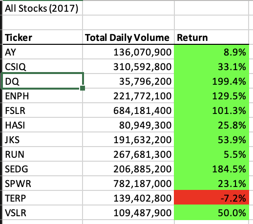
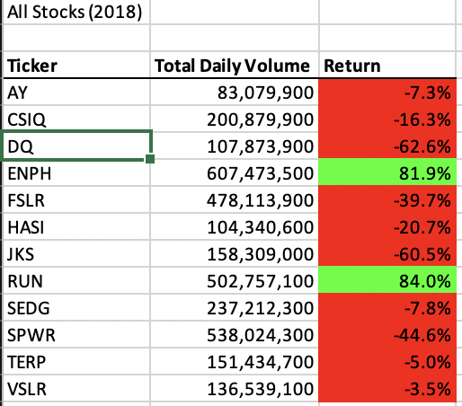
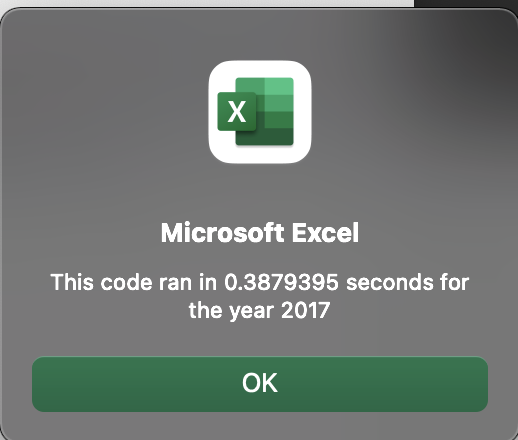
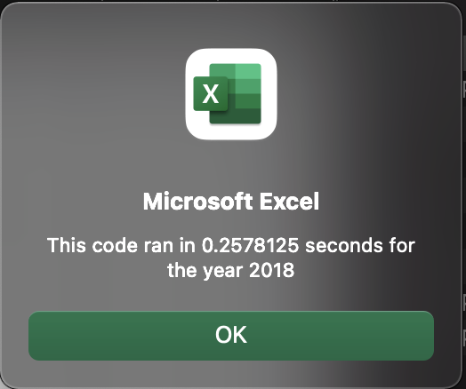
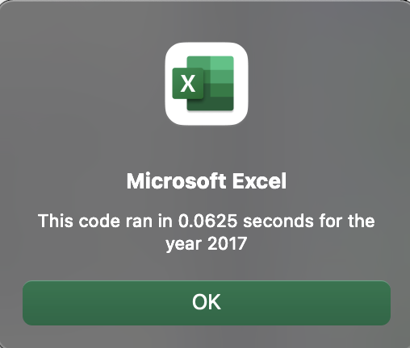
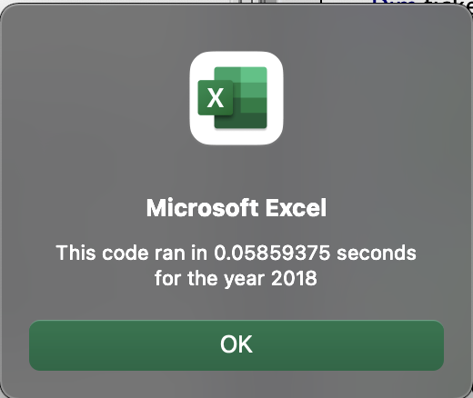

# Stock Analysis with VBA

## Overview of Project

The entirety of this project’s files (both empty and completed) can be found at [https://github.com/luperrin/02-stock-analysis-lukeperrin.git](https://github.com/luperrin/02-stock-analysis-lukeperrin.git).

### Purpose

In this project, fresh finance graduate, Steve, is looking to analyze a [set of data analyzing a stocks](VBA_Challenge.xlsx) for a number of alternative energy companies against one which they had their minds set on. We are looking to help Steve and his parents make sense of this stock data by creating a VBA macro in the Excel workbook to summarize the stock trends through either the year 2017 or 2018. 

## Analysis

### Stock Performance Analysis

The following images display the stock performace across of both the years 2017 and 2018:

The macro summarizes stock performace of each alternative energy company over the two years. We can see that `DQ`'s stock performance in 2017 provided reasonable return, although the total volume was smaller than many of the other companies. However, by 2018 we observe that `DQ`'s stock return drops drastically. 

Alternatively, both `ENPH` and `RUN` presented impressive growths (in terms of `Total Daily Volume ` from 2017 to 2018 while both increasing in their percent `Return`s. Instead of `DQ`, I would recommend either of these alternatives to Steve’s parents for investing.

### Analysis of Macro Runtimes

The following two images present the run times for each year **before** refactoring the code:

The next two images describe the runtime of each year **after** refactoring the code:

After refactoring, the code efficiency increased by 80.6% on average between each year. This runtime difference would prove increasingly significant with the size of the dataset.

## Summary

### Refactoring Code (generally)

Code refactoring is the changing of code’s structure that produces the same purpose as the original code. Generally, refactoring code seeks to promote improvement to the code’s performance or structure (i.e. more efficient runtimes, simpler writing, etc…). However, if done improperly, refactoring could produce the opposite effect. It is important when refactoring to ensure that the refactoring…

1. does not change the code’s functionality (i.e. change the actions it performs) and…
2. promotes improvements to the code’s structure, logic, or performance.

If either of these goals are not met by refactoring, than the refactoring itself proves disadvantageous.

### Refactoring Code (in this VBA script)

In this assignment, we looked to refactor the code that rendered the results presented above. The refactoring accomplished both simplification of the written code as well as improved the performance (time efficiency). As mentioned above, the refactored code produced results on average 80.6% faster than the original code. This was accomplished by refactoring in two ways:

1. Performing on arrays rather than individual variables.
2. Creating three distinct loops instead of performing on loops within loops.

In this case, the only disadvantage to refactoring was the forethought required to produce this more efficient code. However, I would make the argument that this code is in fact much simpler than the original code.
